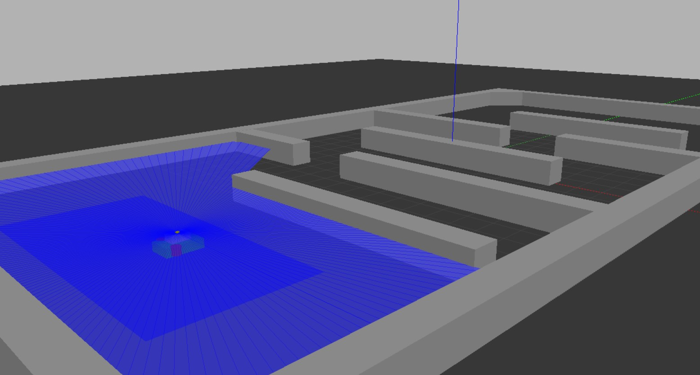

# Autonomous Hovercraft Simulation
Simulation of autonomous hovercraft solving the maze. The simulation is runned on Gazebo and ROS2 env. The algorithm includes dynamic motion control, lidar-based SLAM, and A-star path planning 



## Installation 
- navigate to your ros2 work space to clone the folder.
```
cd ~/ros2_ws/src
git clone https://github.com/tonyhoVN/autonomous-hovercraft-simulation.git
cd .. & colcon build --packages-select hovercraft_simu
```

## Run
```
ros2 launch hovercraft_simu start_final.launch.xml
```
